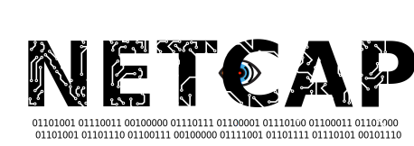
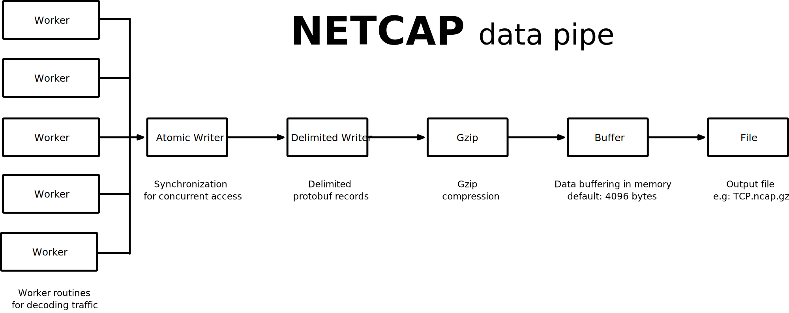
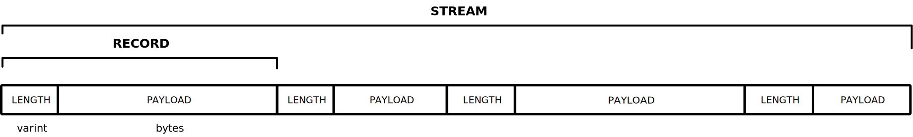
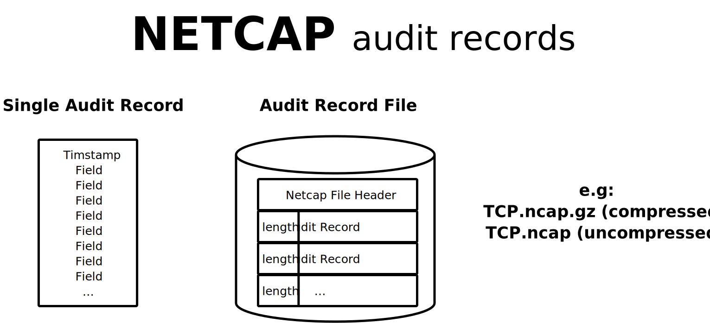
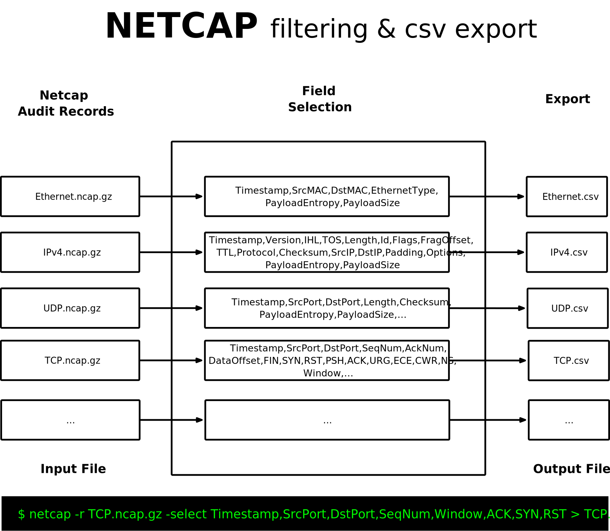
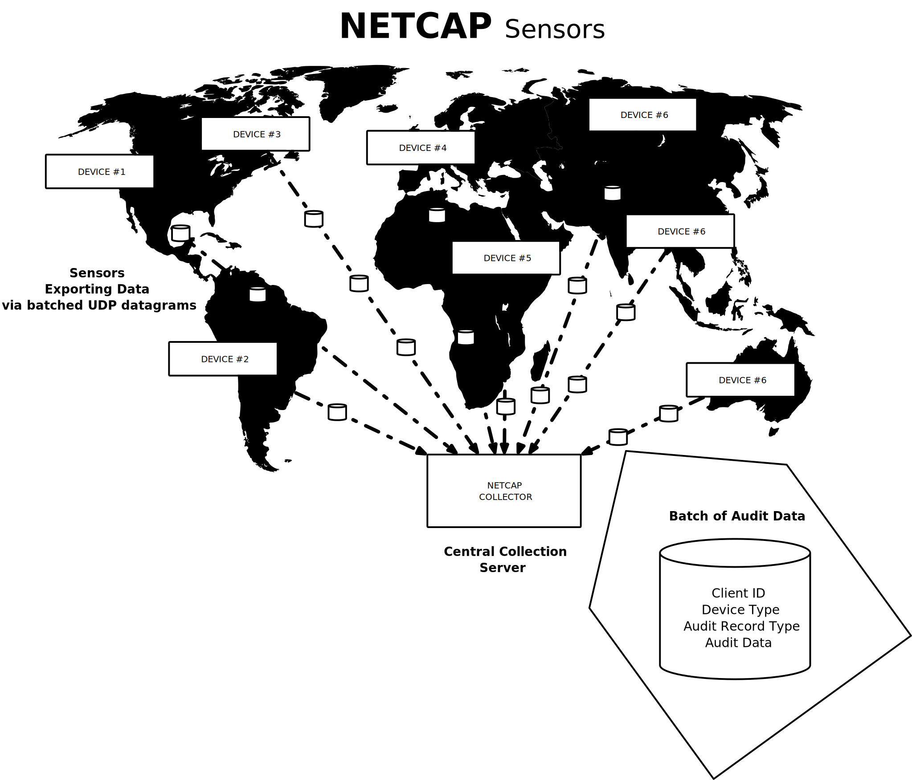
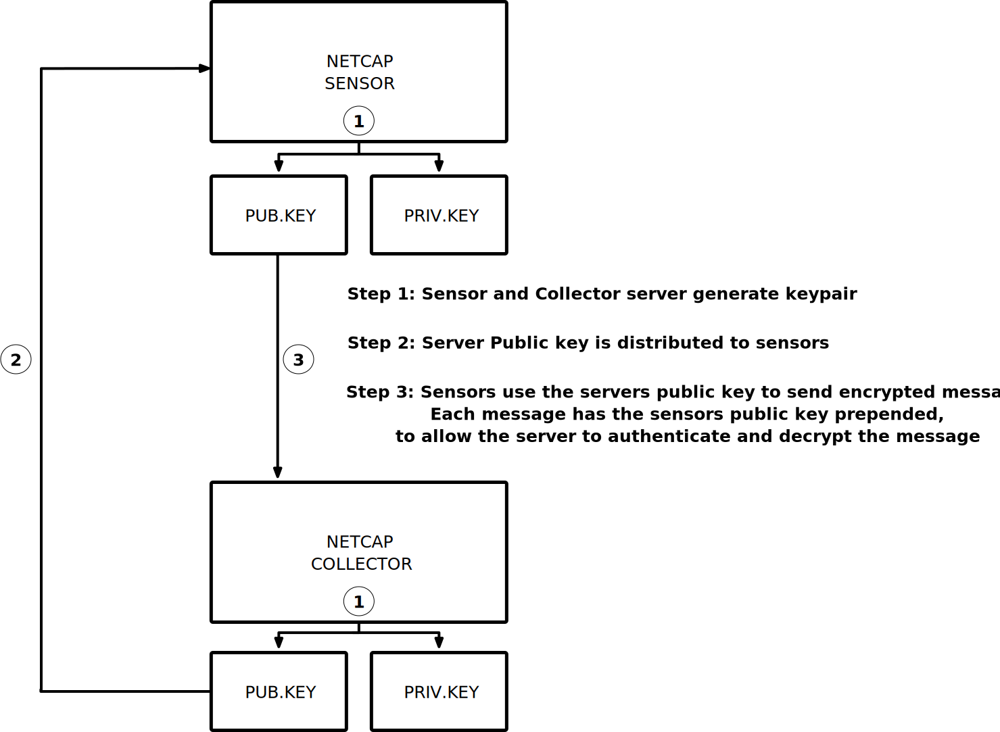
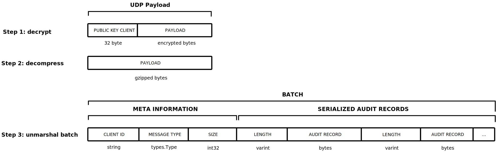
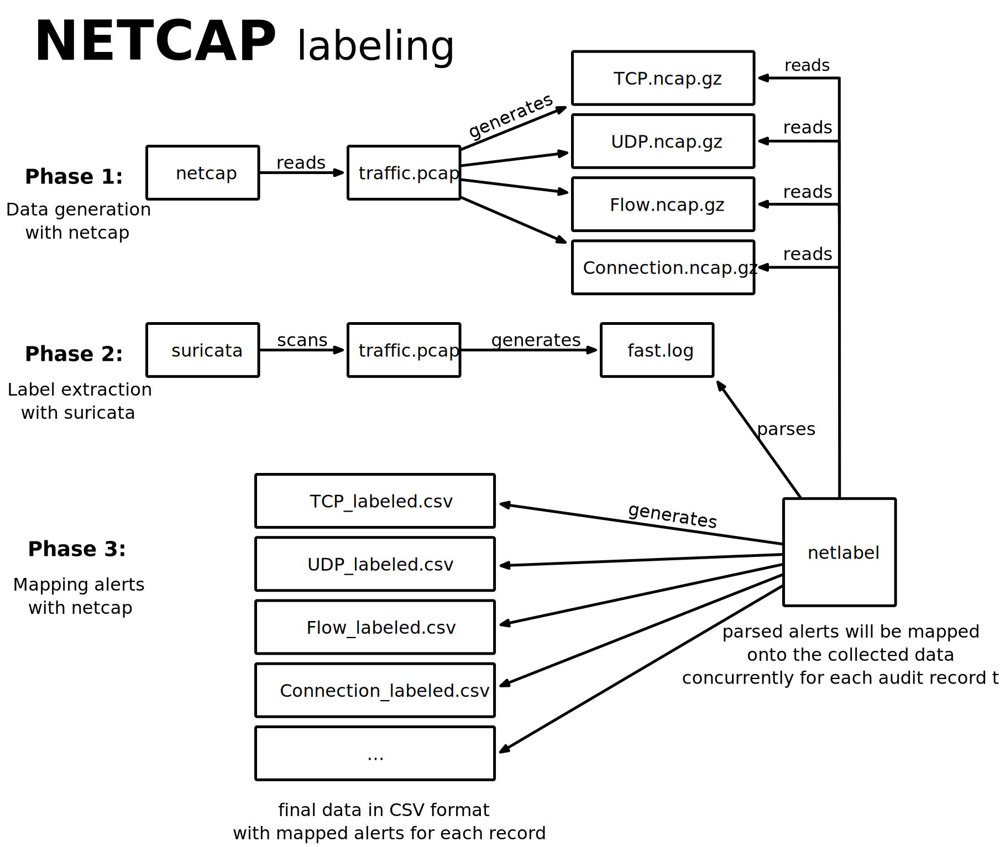

 
 
 

The *Netcap* (NETwork CAPture) framework efficiently converts a stream of network packets into highly accessible type-safe structured data that represent specific protocols or custom abstractions.
These audit records can be stored on disk or exchanged over the network,
and are well suited as a data source for machine learning algorithms.
Since parsing of untrusted input can be dangerous and network data is potentially malicious,
implementation was performed in a programming language that provides a garbage collected memory safe runtime.

It was developed for a series of experiments in my bachelor thesis: _Implementation and evaluation of secure and scalable anomaly-based network intrusion detection_.
Currently, the thesis serves as documentation until the wiki is ready,
it is included at the root of this repository (file: [mied18.pdf](https://github.com/dreadl0ck/netcap/blob/master/mied18.pdf)).
Slides from my presentation at the Leibniz Supercomputing Centre of the Bavarian Academy of Sciences and Humanities are available on [researchgate](https://www.researchgate.net/project/Anomaly-based-Network-Security-Monitoring).

The project won the 2nd Place at Kaspersky Labs SecurIT Cup 2018 in Budapest.

*Netcap* uses Google's Protocol Buffers to encode its output, which allows accessing it across a wide range of programming languages.
Alternatively, output can be emitted as comma separated values, which is a common input format for data analysis tools and systems.
The tool is extensible and provides multiple ways of adding support for new protocols, 
while implementing the parsing logic in a memory safe way.
It provides high dimensional data about observed traffic and allows the researcher to focus on experimenting with novel approaches for detecting malicious behavior in network environments,
instead of fiddling with data collection mechanisms and post processing steps.
It has a concurrent design that makes use of multi-core architectures.
The name *Netcap* was chosen to be simple and descriptive.
The command-line tool was designed with usability and readability in mind,
and displays progress when processing packets.
The latest version offers 58 audit record types of which 53 are protocol specific and 5 are flow models.

This readme serves as a quick overview - for more details please read the thesis.

A simple demonstration of generating audit records from a PCAP dump file,
querying and displaying the collected information in various ways:

And live operation decoding traffic from my wireless network interface, while I am surfing the web:

## Index

- [Design Goals](#design-goals)
- [Specification](#specification)
- [Installation](#installation)
    - [Buildsystem](#buildsystem)
- [Quickstart](#quickstart)
- [Tests](#tests)
- [Supported Protocols](#supported-protocols)
- [Protocol Sub Structure Types](#protocol-sub-structure-types)
- [Available Fields](#available-fields)
    - [Layer Encoders](#layer-encoders)
    - [Custom Encoders](#custom-encoders)
- [Workers](#workers)
- [Data Pipe](#data-pipe)
- [Delimited Protocol Buffer Records](#delimited-protocol-buffer-records)
- [Data Compression](#data-compression)
- [Audit Records](#Audit-records)
- [Encoders](#Encoders)
- [Unknown Protocols](#unknown-protocols)
- [Error Log](#error-log)
- [Show Audit Record File Header](#show-audit-record-file-header)
- [Print Structured Audit Records](#print-structured-audit-records)
- [Print as CSV](#print-as-csv)
- [Print as Tab Separated Values](#print-as-tab-separated-values)
- [Print as Table](#print-as-table)
- [Print with Custom Separator](#print-with-custom-separator)
- [Validate generated Output](#validate-generated-output)
- [Filtering and Export](#filtering-and-export)
    - [Example](#example)
- [Inclusion and Exclusion of Encoders](#inclusion-and-exclusion-of-encoders)
- [Applying Berkeley Packet Filters](#applying-berkeley-packet-filters)
- [Netlabel command-line Tool](#netlabel-command-line-tool)
- [Sensors and Collection Server](#sensors-and-collection-server)
    - [Batch Encryption](#batch-encryption)
    - [Batch Decryption](#batch-decryption)
    - [Usage](#usage)
- [Dataset Labeling](#dataset-labeling)
- [Future Development](#future-development)
- [Use Cases](#use-cases)
- [License](#license)

## Design Goals

- memory safety when parsing untrusted input
- ease of extension
- output format interoperable with many different programming languages
- concurrent design
- output with small storage footprint on disk
- maximum data availability
- allow implementation of custom abstractions
- rich platform and architecture support

The following graphic shows a high level architecture overview:

 

 

Packets are fetched from an input source (offline dump file or live from an interface) and distributed via round-robin to a pool of workers. Each worker dissects all layers of a packet and writes the generated *protobuf* audit records to the corresponding file. By default, the data is compressed with *gzip* to save storage space and buffered to avoid an overhead due to excessive *syscalls* for writing data to disk.

## Specification

*Netcap* files have the file extension **.ncap** or **.ncap.gz** if compressed with gzip and contain serialized protocol buffers of one type. Naming of each file happens according to the naming in the [gopacket](https://godoc.org/github.com/google/gopacket) library: a short uppercase letter representation for common protocols, and a camel case version full word version for less common protocols. Audit records are modeled as protocol buffers.  Each file contains a header that specifies which type of audit records is inside the file, what version of *Netcap* was used to generate it, what input source was used and what time it was created. Each audit record should be tagged with the timestamp the packet was seen,  in the format *seconds.microseconds*. Output is written to a file that represents each data structure from the protocol buffers definition, i.e. *TCP.ncap*, *UDP.ncap*. For this purpose, the audit records are written as length delimited records into the file.

## Installation

Installation via go get:

    $ go get -u github.com/dreadl0ck/netcap/...

To install the command-line tool:

    $ go build -o $(go env GOPATH)/bin/netcap -i github.com/dreadl0ck/netcap/cmd

To cross compile for other architectures, set the *GOARCH* and *GOOS* environment variables.
For example to cross compile a binary for *linux amd64*:

    $ GOARCH=amd64 GOOS=linux go build -o netcap -i github.com/dreadl0ck/netcap/cmd

Install the *netcap* command-line tool with Homebrew:

    $ brew tap dreadl0ck/formulas
    $ brew install netcap

### Buildsystem

*Netcap* uses the [zeus](https://github.com/dreadl0ck/zeus) buildsystem, it can be found on github along with installation instructions.

However, the project can easily be installed without zeus.
All shell scripts needed for installation can be found in the *zeus/generated* directory as standalone versions:

    zeus/generated/install-netcap.sh
	zeus/generated/install-netlabel.sh
	zeus/generated/install-sensor.sh
	zeus/generated/install-server.sh

To install the *Netcap* and *Netlabel* command-line tool and the library with zeus, run:

    $ zeus install

## Quickstart

Read traffic live from interface, stop with *Ctrl-C* (*SIGINT*): 

    $ netcap -iface eth0

Read traffic from a dump file (supports PCAP or PCAPNG):

    $ netcap -r traffic.pcap

Read a netcap dumpfile and print to stdout as CSV:

    $ netcap -r TCP.ncap.gz

Show the available fields for a specific Netcap dump file: 

    $ netcap -fields -r TCP.ncap.gz

Print only selected fields and output as CSV:

    $ netcap -r TCP.ncap.gz -select Timestamp,SrcPort,DstPort

Save CSV output to file:

    $ netcap -r TCP.ncap.gz -select Timestamp,SrcPort,DstPort > tcp.csv

Print output separated with tabs:

    $ netcap -r TPC.ncap.gz -tsv

Run with 24 workers and disable gzip compression and buffering:

    $ netcap -workers 24 -buf false -comp false -r traffic.pcapng

Parse pcap and write all data to output directory (will be created if it does not exist):

    $ netcap -r traffic.pcap -out traffic_ncap

Convert timestamps to UTC:

    $ netcap -r TCP.ncap.gz -select Timestamp,SrcPort,Dstport -utc

## Tests

To execute the unit tests, run the following from the project root:

    go test -v -bench=. ./...

## Supported Protocols and Available Fields

### Layer Encoders

| Layer                         | NumFields | Fields               |
| ----------------------------- | ---------- | -------------------- |
| TCP                           | 22        | Timestamp, SrcPort, DstPort, SeqNum, AckNum, DataOffset, FIN, SYN, RST, PSH, ACK, URG, ECE, CWR, NS, Window, Checksum, Urgent, Padding, Options, PayloadEntropy, PayloadSize             |
| UDP                           |  7        | Timestamp, SrcPort, DstPort, Length, Checksum, PayloadEntropy, PayloadSize             |
| IPv4                          | 17        | Timestamp, Version, IHL, TOS, Length, Id, Flags, FragOffset, TTL, Protocol, Checksum, SrcIP, DstIP, Padding, Options, PayloadEntropy, PayloadSize             |
| IPv6                          | 12        | Timestamp, Version, TrafficClass, FlowLabel, Length, NextHeader, HopLimit, SrcIP, DstIP, PayloadEntropy, PayloadSize, HopByHop             |
| DHCPv4                        | 16        | Timestamp, Operation, HardwareType, HardwareLen, HardwareOpts, Xid, Secs, Flags, ClientIP, YourClientIP, NextServerIP, RelayAgentIP, ClientHWAddr, ServerName, File, Options             |
| DHCPv6                        |  7        | Timestamp, MsgType, HopCount, LinkAddr, PeerAddr, TransactionID, Options             |
| ICMPv4                        |  5        | Timestamp, TypeCode, Checksum, Id, Seq             |
| ICMPv6                        |  3        | Timestamp, TypeCode, Checksum             |
| ICMPv6Echo                    |  3        | Timestamp, Identifier, SeqNumber             |
| ICMPv6NeighborSolicitation    |  3        | Timestamp, TargetAddress, Options             |
| ICMPv6RouterSolicitation      |  2        | Timestamp, Options             |
| DNS                           | 18        | Timestamp, ID, QR, OpCode, AA, TC, RD, RA, Z, ResponseCode, QDCount, ANCount, NSCount, ARCount, Questions, Answers, Authorities, Additionals             |
| ARP                           | 10        | Timestamp, AddrType, Protocol, HwAddressSize, ProtAddressSize, Operation, SrcHwAddress, SrcProtAddress, DstHwAddress, DstProtAddress             |
| Ethernet                      |  6        | Timestamp, SrcMAC, DstMAC, EthernetType, PayloadEntropy, PayloadSize             |
| Dot1Q                         |  5        | Timestamp, Priority, DropEligible, VLANIdentifier, Type             |
| Dot11                         | 14        | Timestamp, Type, Proto, Flags, DurationID, Address1, Address2, Address3, Address4, SequenceNumber, FragmentNumber, Checksum, QOS, HTControl             |
| NTP                           | 15        | Timestamp, LeapIndicator, Version, Mode, Stratum, Poll, Precision, RootDelay, RootDispersion, ReferenceID, ReferenceTimestamp, OriginTimestamp, ReceiveTimestamp, TransmitTimestamp, ExtensionBytes             |
| SIP                           |  3        | Timestamp, OrganizationalCode, Type             |
| IGMP                          | 13        | Timestamp, Type, MaxResponseTime, Checksum, GroupAddress, SupressRouterProcessing, RobustnessValue, IntervalTime, SourceAddresses, NumberOfGroupRecords, NumberOfSources, GroupRecords, Version             |
| LLC                           |  6        | Timestamp, DSAP, IG, SSAP, CR, Control             |
| IPv6HopByHop                  |  2        | Timestamp, Options             |
| SCTP                          |  5        | Timestamp, SrcPort, DstPort, VerificationTag, Checksum             |
| SNAP                          |  3        | Timestamp, OrganizationalCode, Type             |
| LinkLayerDiscovery            |  5        | Timestamp, ChassisID, PortID, TTL, Values             |
| ICMPv6NeighborAdvertisement   |  4        | Timestamp, Flags, TargetAddress, Options             |
| ICMPv6RouterAdvertisement     |  7        | Timestamp, HopLimit, Flags, RouterLifetime, ReachableTime, RetransTimer, Options             |
| EthernetCTP                   |  2        | Timestamp, SkipCount             |
| EthernetCTPReply              |  4        | Timestamp, Function, ReceiptNumber, Data             |
| LinkLayerDiscoveryInfo        |  8        | Timestamp, PortDescription, SysName, SysDescription, SysCapabilities, MgmtAddress, OrgTLVs, Unknown             |
| IPSecAH                       | 5  | Timestamp, Reserved, SPI, Seq, AuthenticationData |
| IPSecESP                      | 4  | Timestamp, SPI, Seq, LenEncrypted |
| Geneve                        | 8  | Timestamp, Version, OptionsLength, OAMPacket, CriticalOption, Protocol, VNI, Options |
| IPv6Fragment                  | 7  | Timestamp, NextHeader, Reserved1, FragmentOffset, Reserved2, MoreFragments, Identification |
| VXLAN                         | 7  | Timestamp, ValidIDFlag, VNI, GBPExtension, GBPDontLearn, GBPApplied, GBPGroupPolicyID |
| USB                           | 20 |  Timestamp, ID, EventType, TransferType, Direction, EndpointNumber, DeviceAddress, BusID, TimestampSec, TimestampUsec, Setup, Data, Status,  UrbLength, UrbDataLength, UrbInterval, UrbStartFrame, UrbCopyOfTransferFlags, IsoNumDesc, Payload |
| LCM                            | 9  | Timestamp, Magic, SequenceNumber, PayloadSize, FragmentOffset, FragmentNumber, TotalFragments, ChannelName, Fragmented |
| MPLS                           | 5  | Timestamp, Label, TrafficClass, StackBottom, TTL |
| ModbusTCP                      | 5  | Timestamp, TransactionIdentifier, ProtocolIdentifier, Length, UnitIdentifier |
| OSPFv2                           | 14  | Timestamp, Version, Type, PacketLength, RouterID, AreaID, Checksum, AuType, Authentication, LSAs, LSU, LSR, DbDesc, HelloV2 |
| OSPFv3                           | 14  | Timestamp, Version, Type, PacketLength, RouterID, AreaID, Checksum, Instance, Reserved, Hello, DbDesc, LSR, LSU, LSAs |
| BFD                            | 17  | Timestamp, Version, Diagnostic, State, Poll, Final, ControlPlaneIndependent, AuthPresent, Demand, Multipoint, DetectMultiplier, MyDiscriminator, YourDiscriminator, DesiredMinTxInterval, RequiredMinRxInterval, RequiredMinEchoRxInterval, AuthHeader |
| GRE                            | 17  | Timestamp, ChecksumPresent, RoutingPresent, KeyPresent, SeqPresent, StrictSourceRoute, AckPresent, RecursionControl, Flags, Version, Protocol, Checksum, Offset, Key, Seq, Ack, Routing |
| FDDI                           | 5  | Timestamp, FrameControl, Priority, SrcMAC, DstMAC |
| EAP                            | 6  | Timestamp, Code, Id, Length, Type, TypeData |
| VRRP                           | 10  | Timestamp, Version, Type, VirtualRtrID, Priority, CountIPAddr, AuthType, AdverInt, Checksum, IPAdresses |
| EAPOL                          | 4  | Timestamp, Version, Type, Length |
| EAPOLKey                       | 22  | Timestamp, KeyDescriptorType, KeyDescriptorVersion, KeyType, KeyIndex, Install, KeyACK, KeyMIC, Secure, MICError, Request, HasEncryptedKeyData, SMKMessage, KeyLength, ReplayCounter, Nonce, IV, RSC, ID, MIC, KeyDataLength, EncryptedKeyData |
| CiscoDiscovery                 | 5  | Timestamp, Version, TTL, Checksum, Values |
| CiscoDiscoveryInfo             | 27  | Timestamp, CDPHello, DeviceID, Addresses, PortID, Capabilities, Version, Platform, IPPrefixes, VTPDomain, NativeVLAN, FullDuplex, VLANReply, VLANQuery, PowerConsumption, MTU, ExtendedTrust, UntrustedCOS, SysName, SysOID, MgmtAddresses, Location, PowerRequest, PowerAvailable, SparePairPoe, EnergyWise, Unknown |
| USBRequestBlockSetup           | 6  | Timestamp, RequestType, Request, Value, Index, Length |
| NortelDiscovery               | 7 | Timestamp, IPAddress, SegmentID, Chassis, Backplane, State, NumLinks |

### Custom Encoders

| Name                        | NumFields  |  Fields   |
| --------- | ---------| --------- |
| TLS                         |  27        | Timestamp, Type, Version, MessageLen, HandshakeType, HandshakeLen, HandshakeVersion, Random, SessionIDLen, SessionID, CipherSuiteLen, ExtensionLen, SNI, OSCP, CipherSuites, CompressMethods, SignatureAlgs, SupportedGroups, SupportedPoints, ALPNs, Ja3, SrcIP, DstIP, SrcMAC, DStMAC, SrcPort, DstPort |
| LinkFlow                    |  9         | TimestampFirst, TimestampLast, Proto, SrcMAC, DstMAC, Size, NumPackets, UID, Duration |
| NetworkFlow                 |  9         | TimestampFirst, TimestampLast, Proto, SrcIP, DstIP, Size, NumPackets, UID, Duration |
| TransportFlow               |  9         | TimestampFirst, TimestampLast, Proto, SrcPort, DstPort, Size, NumPackets, UID, Duration |
| HTTP                        |  14        | Timestamp, Proto, Method, Host, UserAgent, Referer, ReqCookies, ReqContentLength, URL, ResContentLength, ContentType, StatusCode, SrcIP, DstIP |
| Flow                        |  17        | TimestampFirst, LinkProto, NetworkProto, TransportProto, ApplicationProto, SrcMAC, DstMAC, SrcIP, SrcPort, DstIP, DstPort, Size, AppPayloadSize, NumPackets, UID, Duration, TimestampLast |
| Connection                  |  17        | TimestampFirst, LinkProto, NetworkProto, TransportProto, ApplicationProto, SrcMAC, DstMAC, SrcIP, SrcPort, DstIP, DstPort, Size, AppPayloadSize, NumPackets, UID, Duration, TimestampLast |

## Workers

To make use of multi-core processors, processing of packets should happen in an asynchronous way. Since Netcap should be usable on a stream of packets, fetching of packets has to happen sequentially, but decoding them can be parallelized. The packets read from the input data source (PCAP file or network interface) are assigned to a configurable number of workers routines via round-robin. Each of those worker routines operates independently, and has all selected encoders loaded. It decodes all desired layers of the packet, and writes the encoded data into a buffer that will be flushed to disk after reaching its capacity.

[Workers](https://github.com/dreadl0ck/netcap/blob/master/collector/worker.go) are a core concept of *Netcap*, as they handle the actual task of decoding each packet.
*Netcap* can be configured to run with the desired amount of workers, the default is 1000,
since this configuration has shown the best results on the development machine.
Increasing the number of workers also increases the number of runtime operations for goroutine scheduling,
thus performance might decrease with a huge amount of workers.
It is recommended to experiment with different configurations on the target system,
and choose the one that performs best.
Packet data fetched from the input source is distributed to a worker pool for decoding in round robin style.
Each worker decodes all layers of a packet and calls all available custom encoders.
After decoding of each layer, the generated protocol buffer instance is written into the *Netcap* data pipe.
Packets that produced an error in the decoding phase or carry an unknown protocol are being written in the corresponding logs and dumpfiles.

 

 

Each worker receives its data from an input channel.
This channel can be buffered, by default the buffer size is 100,
also because this configuration has shown the best results on the development machine.
When the buffer size is set to zero, the operation of writing a packet into the channel blocks, 
until the goroutine behind it is ready for consumption.
That means, the goroutine must finish the currently processed packet, until a new packet can be accepted.
By configuring the buffer size for all routines to a specific number of packets,
distributing packets among workers can continue even if a worker is not finished yet when new data arrives.
New packets will be queued in the channel buffer, and writing in the channels will only block if the buffer is full.

 

 

## Data Pipe

The Netcap data pipe describes the way from a network packet that has been processed in a worker routine, to a serialized, delimited and compressed record into a file on disk.

 

 

## Delimited Protocol Buffer Records

The data format on disk consists of gzipped length-delimited byte records. Each delimited Protocol Buffer record is preceded by a variable-length encoded integer (varint) that specifies the length of the serialized protocol buffer record in bytes. A stream consists of a sequence of such records packed consecutively without additional padding. There are no checksums or compression involved in this processing step.

 

 

## Data Compression

Encoding the output as protocol buffers does not help much with reducing the size, compared to the CSV format. To further reduce the disk size required for storage, the data is gzipped prior to writing it into the file. This makes the resulting files around 70% smaller. Gzip is a common and well supported format, support for decoding it exists in almost every programming language. If this is not desired for e.g. direct access to the stored data, this can be toggled with the -comp command-line flag.

## Audit Records

A piece of information produced by Netcap is called an audit record. Audit records are type safe structured data, encoded as protocol buffers. An audit record can describe a specific protocol, or other abstractions built on top of observations from the analyzed traffic. Netcap does currently not enforce the presence of any special fields for each audit record, however by convention each audit record should have a timestamp with microsecond precision. A record file contains a header followed by a list of length-delimited serialized audit records. Naming of the audit record file happens according to the encoder name and should signal whether the file contents are compressed by adding the .gz extension.

 

 

## Encoders

Encoders take care of converting decoded packet data into protocol buffers for the audit records.
Two types of encoders exist: the [Layer Encoder](https://github.com/dreadl0ck/netcap/blob/master/encoder/layerEncoder.go), which operates on *gopacket* layer types,
and the [Custom Encoder](https://github.com/dreadl0ck/netcap/blob/master/encoder/customEncoder.go), for which any desired logic can be implemented, 
including decoding application layer protocols that are not yet supported by gopacket or protocols that require stream reassembly.

## Unknown Protocols

Protocols that cannot be decoded will be dumped in the unknown.pcap file for later analysis, as this contains potentially interesting traffic that is not represented in the generated output. Separating everything that could not be understood makes it easy to reveal hidden communication channels, which are based on custom protocols.

## Error Log

Errors that happen in the gopacket lib due to malformed packets or implementation errors are written to disk in the errors.log file, and can be checked by the analyst later. Each packet that had a decoding error on at least one layer will be added to the errors.pcap. An entry to the error log has the following format:

    <UTC Timestamp>
    Error: <Description>
    Packet:
    <full packet hex dump with layer information>

At the end of the error log, a summary of all errors and the number of their occurrences will be appended.

    ...
    <error name>: <number of occurrences>
    ...

## Show Audit Record File Header

To display the header of the supplied audit record file, the -header flag can be used:

    $ netcap -r TCP.ncap.gz -header

    +----------+---------------------------------------+
    |  Field   |                Value                  |
    +----------+---------------------------------------+
    | Created  | 2018-11-15 04:42:22.411785 +0000 UTC  |
    | Source   | Wednesday-WorkingHours.pcap           |
    | Version  | v0.3.3                                |
    | Type     | NC_TCP                                |
    +----------+---------------------------------------+

## Print Structured Audit Records

Audit records can be printed structured, this makes use of the *proto.MarshalTextString()* function. This is sometimes useful for debugging, but very verbose.

    $ netcap -r TCP.ncap.gz -struc
    ...
    NC_TCP
    Timestamp: "1499255023.848884"
    SrcPort: 80
    DstPort: 49472
    SeqNum: 1959843981
    AckNum: 3666268230
    DataOffset: 5
    ACK: true
    Window: 1025
    Checksum: 2348
    PayloadEntropy: 7.836586993143013
    PayloadSize: 1460
    ...

## Print as CSV

This is the default behavior. First line contains all field names.

    $ netcap -r TCP.ncap.gz
    Timestamp,SrcPort,DstPort,SeqNum,AckNum,DataOffset,FIN,SYN,RST,PSH,ACK,URG,...
    1499254962.234259,443,49461,1185870107,2940396492,5,false,false,false,true,true,false,...
    1499254962.282063,49461,443,2940396492,1185870976,5,false,false,false,false,true,false,...
    ...

## Print as Tab Separated Values

To use a tab as separator, the *-tsv* flag can be supplied:
    
    $ netcap -r TCP.ncap.gz -tsv
    Timestamp               SrcPort DstPort Length  Checksum PayloadEntropy  PayloadSize
    1499254962.084372       49792   1900    145     34831    5.19616448      137
    1499254962.084377       49792   1900    145     34831    5.19616448      137
    1499254962.084378       49792   1900    145     34831    5.19616448      137
    1499254962.084379       49792   1900    145     34831    5.19616448      137
    ...

## Print as Table

The *-table* flag can be used to print output as a table.
Every 100 entries the table is printed to stdout.

    $ netcap -r UDP.ncap.gz -table -select Timestamp,SrcPort,DstPort,Length,Checksum
    +--------------------+----------+----------+---------+-----------+
    |     Timestamp      | SrcPort  | DstPort  | Length  | Checksum  |
    +--------------------+----------+----------+---------+-----------+
    | 1499255691.722212  | 62109    | 53       | 43      | 38025     |
    | 1499255691.722216  | 62109    | 53       | 43      | 38025     |
    | 1499255691.722363  | 53       | 62109    | 59      | 37492     |
    | 1499255691.722366  | 53       | 62109    | 59      | 37492     |
    | 1499255691.723146  | 56977    | 53       | 43      | 7337      |
    | 1499255691.723149  | 56977    | 53       | 43      | 7337      |
    | 1499255691.723283  | 53       | 56977    | 59      | 6804      |
    | 1499255691.723286  | 53       | 56977    | 59      | 6804      |
    | 1499255691.723531  | 63427    | 53       | 43      | 17441     |
    | 1499255691.723534  | 63427    | 53       | 43      | 17441     |
    | 1499255691.723682  | 53       | 63427    | 87      | 14671     |
    ...

## Print with Custom Separator

Output can also be generated with a custom separator:

    $ netcap -r TCP.ncap.gz -sep ";"
    Timestamp;SrcPort;DstPort;Length;Checksum;PayloadEntropy;PayloadSize
    1499254962.084372;49792;1900;145;34831;5.19616448;137
    1499254962.084377;49792;1900;145;34831;5.19616448;137
    1499254962.084378;49792;1900;145;34831;5.19616448;137
    ...

## Validate generated Output

To ensure values in the generated CSV would not contain the separator string,
the *-check* flag can be used.

This will determine the expected number of separators for the audit record type,
and print all lines to stdout that do not have the expected number of separator symbols.
The separator symbol will be colored red with ansi escape sequences 
and each line is followed by the number of separators in red color. 

The *-sep* flag can be used to specify a custom separator.

    $ netcap -r TCP.ncap.gz -check
    $ netcap -r TCP.ncap.gz -check -sep=";"

## Filtering and Export

Netcap offers a simple interface to filter for specific fields and select only those of interest. Filtering and exporting specific fields can be performed with all available audit record types, over a uniform command-line interface. By default, output is generated as CSV with the field names added as first line. It is also possible to use a custom separator string. Fields are exported in the order they are named in the select statement. Sub structures of audit records (for example IPv4Options from an IPv4 packet), are converted to a human readable string representation. More examples for using this feature on the command-line can be found in the usage section.

 

 

Netcap offers a simple command-line interface to select fields of interest from the gathered audit records.

### Example

Show available header fields:

    $ netcap -r UDP.ncap.gz -fields
    Timestamp,SrcPort,DstPort,Length,Checksum,PayloadEntropy,PayloadSize

Print all fields for the supplied audit record:
    
    $ netcap -r UDP.ncap.gz
    1331904607.100000,53,42665,120,41265,4.863994469989251,112 
    1331904607.100000,42665,53,53,1764,4.0625550894074385,45 
    1331904607.290000,51190,53,39,22601,3.1861758166070766,31 
    1331904607.290000,56434,53,39,37381,3.290856864924384,31 
    1331904607.330000,137,137,58,64220,3.0267194361875682,50
    ...

Selecting fields will also define their order:

    $ netcap -r UDP.ncap.gz -select Length,SrcPort,DstPort,Timestamp 
    Length,SrcPort,DstPort,Timestamp
    145,49792,1900,1499254962.084372
    145,49792,1900,1499254962.084377
    145,49792,1900,1499254962.084378
    145,49792,1900,1499254962.084379 
    145,49792,1900,1499254962.084380 
    ...

Print selection in the supplied order and convert timestamps to UTC time:

    $ netcap -r UDP.ncap.gz -select Timestamp,SrcPort,DstPort,Length -utc
    2012-03-16 13:30:07.1 +0000 UTC,53,42665,120
    2012-03-16 13:30:07.1 +0000 UTC,42665,53,53
    2012-03-16 13:30:07.29 +0000 UTC,51190,53,39
    2012-03-16 13:30:07.29 +0000 UTC,56434,53,39
    2012-03-16 13:30:07.33 +0000 UTC,137,137,58
    ...

To save the output into a new file, simply redirect the standard output:
    
    $ netcap -r UDP.ncap.gz -select Timestamp,SrcPort,DstPort,Length -utc > UDP.csv

## Inclusion and Exclusion of Encoders

The *-encoders* flag can be used to list all available encoders. In case not all of them are desired, selective inclusion and exclusion is possible, by using the *-include* and *-exclude* flags.

List all encoders:

    $ netcap -encoders
    custom:
    + TLS
    + LinkFlow
    + NetworkFlow
    + TransportFlow
    + HTTP
    + Flow
    + Connection
    layer:
    + TCP
    + UDP
    + IPv4
    + IPv6
    + DHCPv4
    + DHCPv6
    + ICMPv4
    + ICMPv6
    + ICMPv6Echo
    ...    

Include specific encoders (only those named will be used):

    $ netcap -r traffic.pcap -include Ethernet,Dot1Q,IPv4,IPv6,TCP,UDP,DNS

Exclude encoders (this will prevent decoding of layers encapsulated by the excluded ones):

    $ netcap -r traffic.pcap -exclude TCP,UDP

## Applying Berkeley Packet Filters

*Netcap* will decode all traffic it is exposed to, therefore it might be desired to set a berkeley packet filter,
to reduce the workload imposed on *Netcap*.
This is possible for both live and offline operation.
In case a [BPF](https://www.kernel.org/doc/Documentation/networking/filter.txt) should be set for offline use, 
the [gopacket/pcap](https://godoc.org/github.com/google/gopacket/pcap) package with bindings to the *libpcap* will be used,
since setting BPF filters is not yet supported by the native [pcapgo](https://godoc.org/github.com/google/gopacket/pcapgo) package.

When capturing live from an interface:

    $ netcap -iface en0 -bpf "host 192.168.1.1"

When reading offline dump files:

    $ netcap -r traffic.pcap -bpf "host 192.168.1.1"

## Netlabel command-line Tool

In the following common operations with the netlabel tool on the command-line are presented and explained. The tool can be found in the *label/cmd* package.

To display the available command-line flags, the *-h* flag must be used:

    $ netlabel -h 
    Usage of netlabel:
        -collect
            append classifications from alert with duplicate timestamps to the generated label
        -description
            use attack description instead of classification for labels
        -disable -layers
            do not map layer types by timestamp
        -exclude string
            specify a comma separated list of suricata classifications that shall be excluded from the generated labeled csv
        -out string
            specify output directory, will be created if it does not exist
        -progress
            use progress bars
        -r string
            read specified file, can either be a pcap or netcap audit record file
        -sep string
            set separator string for csv output (default ",")
        -strict
            fail when there is more than one alert for the same timestamp

Scan input pcap and create labeled csv files by mapping audit records in the current directory:

    $ netlabel -r traffic.pcap

Scan input pcap and create output files by mapping audit records from the output directory:

    $ netlabel -r traffic.pcap -out output_dir

Abort if there is more than one alert for the same timestamp:

    $ netlabel -r taffic.pcap -strict

Display progress bar while processing input (experimental):

    $ netlabel -r taffic.pcap -progress

Append classifications for duplicate labels:

    $ netlabel -r taffic.pcap -collect

## Sensors and Collection Server

Using Netcap as a data collection mechanism, sensor agents can be deployed to export the traffic they see to a central collection server. This is especially interesting for internet of things (IoT) applications, since these devices are placed inside isolated networks and thus the operator does not have any information about the traffic the device sees. Although Go was not specifically designed for this application, it is an interesting language for embedded systems. Each binary contains the complete runtime, which increases the binary size but requires no installation of dependencies on the device itself. Data exporting currently takes place in batches over UDP sockets. Transferred data is compressed in transit and encrypted with the public key of the collection server. Asymmetric encryption was chosen, to avoid empowering an attacker who compromised a sensor, to decrypt traffic of all sensors communicating with the collection server. To increase the performance, in the future this could be replaced with using a symmetric cipher, together with a solid concept for key rotation and distribution. Sensor agents do not write any data to disk and instead keep it in memory before exporting it.

 

 

As described in the concept chapter, sensors and the collection server use UDP datagrams for communication.
Network communication was implemented using the go standard library. 
This section will focus on the procedure of encrypting the communication between sensor and collector.
For encryption and decryption, cryptographic primitives from the [golang.org/x/crypto/nacl/box](https://godoc.org/golang.org/x/crypto/nacl/box) package are used.
The NaCl (pronounced 'Salt') toolkit was developed by the reowned cryptographer Daniel J. Bernstein.
The box package uses *Curve25519*, *XSalsa20* and *Poly1305* to encrypt and authenticate messages.

It is important to note that the length of messages is not hidden.
Netcap uses a thin wrapper around the functionality provided by the nacl package,
the wrapper has been published here: [github.com/dreadl0ck/cryptoutils](https://www.github.com/dreadl0ck/cryptoutils).

### Batch Encryption

The collection server generates a keypair, consisting of two 32 byte (256bit) keys, hex encodes them and writes the keys to disk. The created files are named *pub.key* and *priv.key*. Now, the servers public key can be shared with sensors. Each sensor also needs to generate a keypair, in order to encrypt messages to the collection server with their private key and the public key of the server. To allow the server to decrypt and authenticate the message, the sensor prepends its own public key to each message.

 

 

### Batch Decryption

When receiving an encrypted batch from a sensor, the server needs to trim off the first 32 bytes, to get the public key of the sensor. Now the message can be decrypted, and decompressed. The resulting bytes are serialized data for a batch protocol buffer. After unmarshalling them into the batch structure, the server can append the serialized audit records carried by the batch, into the corresponding audit record file for the provided client identifier.

 

 

### Usage

Both sensor and client can be configured by using the *-addr* flag to specify an IP address and port. To generate a keypair for the server, the *-gen-keypair* flag must be used:

    $ netcap-server -gen-keypair 
    wrote keys
    $ ls
    priv.key pub.key

Now, the server can be started, the location of the file containing the private key must be supplied:

    $ netcap -server -privkey priv.key -addr 127.0.0.1:4200

The server will now be listening for incoming messages. Next, the sensor must be configured. The keypair for the sensor will be generated on startup, but the public key of the server must be provided:

    $ netcap -sensor -pubkey pub.key -addr 127.0.0.1:4200
    got 126 bytes of type NC_ICMPv6RouterAdvertisement expected [126] got size [73] for type NC_Ethernet
    got 73 bytes of type NC_Ethernet expected [73]
    got size [27] for type NC_ICMPv6
    got size [126] for type NC_ICMPv6RouterAdvertisement
    got 126 bytes of type NC_ICMPv6RouterAdvertisement expected [126] got size [75] for type NC_IPv6
    got 75 bytes of type NC_IPv6 expected [75]
    got 27 bytes of type NC_ICMPv6 expected [27]

The client will now collect the traffic live from the specified interface, and send it to the configured server, once a batch for an audit record type is complete. The server will log all received messages:

    $ netcap -server -privkey priv.key -addr 127.0.0.1:4200 
    packet-received: bytes=2412 from=127.0.0.1:57368 decoded batch NC_Ethernet from client xyz
    new file xyz/Ethernet.ncap
    packet-received: bytes=2701 from=127.0.0.1:65050 decoded batch NC_IPv4 from client xyz
    new file xyz/IPv4.ncap
    ...

When stopping the server with a *SIGINT* (Ctrl-C), all audit record file handles will be flushed and closed properly.

## Dataset Labeling

The term labeling refers to the procedure of adding classification information to each audit record. For the purpose of intrusion detection this is usually a label stating whether the record is normal or malicious. This is called binary classification, since there are just two choices for the label (good / bad) [BK14]. Efficient and precise creation of labeled datasets is important for supervised machine learning techniques. To create labeled data, Netcap parses logs produced by suricata and extracts information for each alert. The quality of labels therefore depends on the quality of the used ruleset. In the next step it iterates over the data generated by itself and maps each alert to the corresponding packets, connections or flows. This takes into account all available information on the audit records and alerts. More details on the mapping logic can be found in the implementation chapter. While labeling is usually performed by marking all packets of a known malicious IP address, Netcap implements a more granular and thus more precise approach of mapping labels for each record. Labeling happens asynchronously for each audit record type in a separate goroutine.

 

 

## Future Development

As outlined in the future chapter of the thesis,
*Netcap* will be further extended, including:

- increase unit test coverage
- more robust error handling & pentest
- benchmarks & performance optimizations
- more extracted features that haven proven value in other academic publications
- data export to various SIEM / visualization tools (Grafana, Splunk, Elastic Stack, etc)
- support for some ICS protocols
- SSH audit record type and Go implementation of the HASSH technique from salesforce
- Deep Packet Inspection Module that looks for certain patterns in the payload to identify the application layer before discarding the payload data
- implement IPv6 stream reassembly
- implement an interface for application layer decoders that require stream reassembly

Additional recent datasets should be evaluated using *Netcap*,
also the next round of experiments with supervised techniques should be conducted with the ET Pro ruleset for labeling.
Besides that, *Netcap* can of course also be used as a data source for unsupervised machine learning strategies.

Interested in implementing new functionality? 
Ideas, Feedback, Questions?
Get in touch! :)

## Use Cases

- monitoring honeypots
- monitoring medical / industrial devices
- research on anomaly-based detection mechanisms
- Forensic data analysis

## License

Netcap is licensed under the GNU General Public License v3, which is a very permissive open source license, that allows others to do almost anything they want with the project, except to distribute closed source versions. This license type was chosen with Netcaps research purpose in mind, and in the hope that it leads to further improvements and new capabilities contributed by other researchers on the long term.

## Source Code Stats

generated with cloc version 1.80

> cloc --exclude-ext pb.go,py,rb cmd sensor server label types utils collector encoder netcap.go reader.go utils.go

        175 text files.
        175 unique files.
        3 files ignored.

    github.com/AlDanial/cloc v 1.80  T=0.12 s (1412.6 files/s, 130948.3 lines/s)
    -------------------------------------------------------------------------------
    Language                     files          blank        comment           code
    -------------------------------------------------------------------------------
    Go                             172           1963           3119          10862
    -------------------------------------------------------------------------------
    SUM:                           172           1963           3119          10862