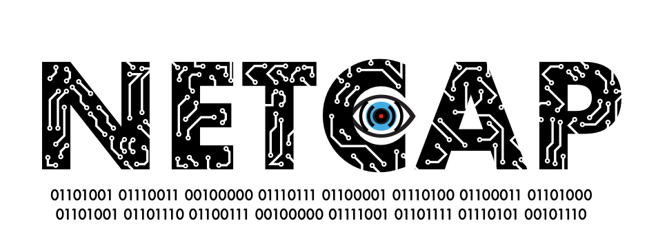

 
 
 

The *Netcap* (NETwork CAPture) framework efficiently converts a stream of network packets into platform neutral type-safe structured audit records that represent specific protocols or custom abstractions.
These audit records can be stored on disk or exchanged over the network,
and are well suited as a data source for machine learning algorithms.
Since parsing of untrusted input can be dangerous and network data is potentially malicious,
a programming language that provides a garbage collected memory safe runtime is used for the implementation.

It was developed for a series of experiments in my bachelor thesis: _Implementation and evaluation of secure and scalable anomaly-based network intrusion detection_.
Slides from my presentation at the Leibniz Supercomputing Centre of the Bavarian Academy of Sciences and Humanities are available on [researchgate](https://www.researchgate.net/project/Anomaly-based-Network-Security-Monitoring).

The project won the 2nd Place at Kaspersky Labs SecurIT Cup 2018 in Budapest.

*Netcap* uses Google's Protocol Buffers to encode its output, which allows accessing it across a wide range of programming languages.
Alternatively, output can be emitted as comma separated values, which is a common input format for data analysis tools and systems.
The tool is extensible and provides multiple ways of adding support for new protocols, 
while implementing the parsing logic in a memory safe way.
It provides high dimensional data about observed traffic and allows the researcher to focus on experimenting with novel approaches for detecting malicious behavior in network environments,
instead of fiddling with data collection mechanisms and post processing steps.
It has a concurrent design that makes use of multi-core architectures.
The name *Netcap* was chosen to be simple and descriptive.
The command-line tool was designed with usability and readability in mind,
and displays progress when processing packets.
The latest version offers 58 audit record types of which 53 are protocol specific and 5 are flow models.

For more details please refer to the [Documentation](https://docs.netcap.io), visit the [Homepage](https://netcap.io) and read the [thesis](https://github.com/dreadl0ck/netcap/blob/master/mied18.pdf).

A simple demonstration of generating audit records from a PCAP dump file,
querying and displaying the collected information in various ways:

And live operation decoding traffic from my wireless network interface, while I am surfing the web:

## Design Goals

- memory safety when parsing untrusted input
- ease of extension
- output format interoperable with many different programming languages
- concurrent design
- output with small storage footprint on disk
- gather everything, separate what can be understood from what can't
- allow implementation of custom abstractions
- rich platform and architecture support

## Use Cases

- monitoring honeypots
- monitoring medical / industrial devices
- research on anomaly-based detection mechanisms
- forensic data analysis

## Framework Components

The framework consists of 9 logically separate tools compiled into a single binary:

- capture (capture audit records live or from dumpfiles)
- dump (dump with audit records in various formats)
- label (tool for creating labeled CSV datasets from netcap data)
- collect (collection server for distributed collection)
- agent (sensor agent for distributed collection)
- proxy (http reverse proxy for capturing traffic from web services)
- util (utility tool for validating audit records and converting timestamps)
- export (exporter for prometheus metrics)
- transform (maltego transformation plugin)

## Integrations

### Prometheus Metrics

Overview Dashboard example:

HTTP Dashboard example:

You can read more about the Prometheus integration in the [docs](https://app.gitbook.com/@netcap/s/netcap/v/v0.5/maltego-integration).

### Maltego

Extract DHCP information from local network devices of a PCAP dump file:

HTTP File extraction:

HTTP parameter command injection analysis: 

You can read more about the Maltego integration in the [docs](https://app.gitbook.com/@netcap/s/netcap/v/v0.5/maltego-integration).

## Contributing

Contributions welcome, there's plenty of stuff to do, from simple additions to low level framework engineering!

Please see the [Contributing Page](https://docs.netcap.io/v/v0.5/contributing) for more information.

## Bug Reports

If you encounter a bug while using Netcap, please fill out the [bugreport template](https://github.com/dreadl0ck/netcap/blob/master/docs/bugreport.md) and open a github issue.

## License

Netcap is licensed under the GNU General Public License v3, which is a very permissive open source license, that allows others to do almost anything they want with the project, except to distribute closed source versions. This license type was chosen with Netcaps research purpose in mind, and in the hope that it leads to further improvements and new capabilities contributed by other researchers on the long term.

