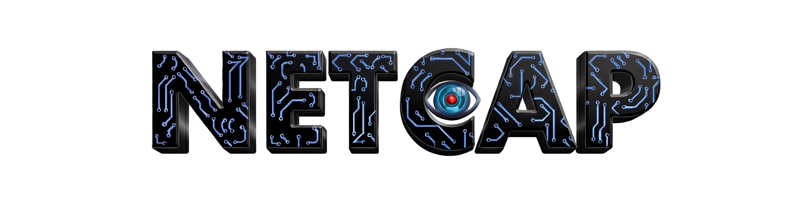
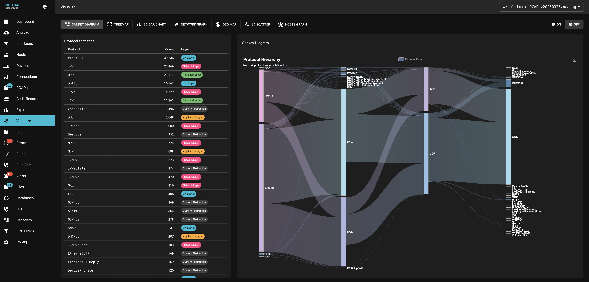

<a href="https://netcap.io">
  
</a>

<br>

[](https://goreportcard.com/report/github.com/dreadl0ck/netcap)
[](https://raw.githubusercontent.com/dreadl0ck/netcap/master/LICENSE)
[](https://golang.org)


[](https://godoc.org/github.com/dreadl0ck/netcap)
[](https://netcap.io)
[](https://docs.netcap.io)
[](https://app.fossa.com/projects/git%2Bgithub.com%2Fdreadl0ck%2Fnetcap?ref=badge_shield)
[](https://deepwiki.com/dreadl0ck/netcap)

**Netcap** (NETwork CAPture) converts network packets into structured, type-safe Protocol Buffer audit records — designed for security monitoring, forensic analysis, and machine learning. A single Go binary with 83 packet decoders, 40+ stream decoders, and 141+ audit record types, backed by a concurrent architecture and a built-in web UI.

<a href="docs/GALLERY.md">
  
</a>

<p align="center"><em>Protocol hierarchy visualization in the Netcap web UI — <a href="docs/GALLERY.md">more screenshots</a></em></p>

## Features

### Protocol Analysis

- **83 packet-layer decoders** — Ethernet, IPv4/6, TCP, UDP, DNS, DHCP, ARP, TLS ClientHello/ServerHello, ICMP, NTP, SIP, OSPF, BGP, MPLS, GRE, VXLAN, 802.11, and many more
- **40+ stream decoders** — TLS, SSH, HTTP/2, QUIC, SMB, FTP, SMTP, POP3, IMAP, IRC, Kerberos, DCERPC, and more
- **Industrial protocols** — Modbus, S7Comm, DNP3, OPC-UA, PROFINET, BACnet, CIP, IEC 62351
- **Full TCP/UDP stream reassembly** with configurable limits

### Web UI

Built-in React (Vite + TypeScript) dashboard in service mode with interactive visualizations:

- Sankey diagrams, treemaps, 3D scatter plots, geo maps, host communication graphs
- Record browsing with JSON/UI views and field-level filtering
- Protocol statistics, connection analysis, host profiling, alert management

See the [Gallery](docs/GALLERY.md) for screenshots.

### Security Analysis

- **JA4 fingerprinting** — BSD-licensed JA4 TLS client fingerprinting; external JA4+ support is available only in opt-in local source builds subject to the FoxIO License
- **YARA rules** — file scanning with compiled yara-x rules for malware detection
- **Magika AI** — Google's AI-based file type classification on extracted files
- **Credential harvesting** — configurable protocol-aware credential capture
- **File extraction** — extract files from HTTP, FTP, SMTP, POP3, IMAP, SMB, IRC with hashing (MD5, SHA1, SHA256) and MIME detection
- **Detection rules** — 30+ YAML rule categories covering reconnaissance, exfiltration, web attacks, industrial ports, and more. The expression engine supports source→distinct-destination cardinality (fan-out) detection, an approved-workstation allowlist (`IsApprovedWorkstation`), and time-of-day helpers (`IsBusinessHours`, `HourOfDay`)
- **OT/ICS threat hunting** — function-code level Siemens S7comm detection (write / logic download / logic theft / PLC stop / CPU restart) mapped to [CISA AA26-231A](docs/s7-threat-hunt-AA26-231A.md); ships `internal/rules/examples/s7comm_hunt.yml`

### Output Formats

- **Protocol Buffers** (default) — compact binary, accessible from any language
- **CSV** — configurable separators for data analysis pipelines
- **JSON** — human-readable structured output
- **Elasticsearch** — direct bulk indexing for ELK stack analysis

### Enrichment

- DNS reverse resolution
- GeoIP geolocation and ASN: bundled DB-IP Lite with optional user-installed
  GeoLite2. Select providers using `-geoProviders dbip,geolite2` (default order)
  or the Databases page; see [GeoIP configuration](internal/dbs/README.md#geolocation-providers).
- MAC vendor lookup
- Deep Packet Inspection (optional, via nDPI/libprotoident)
- **Hyperscan / Vectorscan** acceleration (optional) — multi-pattern regex prefilter for nmap service probes (~2.2× faster), CMS/web framework detection (~1.4×) and rule-engine `MatchesPattern` (up to ~6× on miss-heavy detection traffic), see [docs/hyperscan.md](docs/hyperscan.md)

### Integrations

- **Prometheus + Grafana** — real-time metrics and dashboards
- **Elasticsearch + Kibana** — full-text search and visualization
- **Maltego** — 45+ OSINT entity types and transforms

### Distributed Capture

Agents stream audit records to a collection server over mutually authenticated TLS 1.3, with pinned keys, acknowledged delivery and reconnects. See [docs/distributed-collection.md](docs/distributed-collection.md).

## Quick Start

Pre-built binaries are available on the [Releases](https://github.com/dreadl0ck/netcap/releases) page. To build from source:

```bash
# Build (requires libpcap)
go build -o net ./cmd/net/

# Build without DPI (fewer C dependencies)
go build -tags=nodpi -o net ./cmd/net/

# Build with Hyperscan / Vectorscan acceleration for service probes
# (requires libhs via pkg-config; e.g. `brew install vectorscan` on macOS)
# See docs/hyperscan.md for details.
CGO_ENABLED=1 go build -tags hyperscan -o net ./cmd/net/

# Capture from PCAP file
./net capture -read traffic.pcap

# Live capture
sudo ./net capture -iface en0

# Service mode (starts web UI)
./net capture -read traffic.pcap --service

# Service mode with hot reload (development)
air
```

## Behavioral monitoring

`capture -behavior` and `agent -behavior` enable passive, sensor/interface/VLAN-
scoped observations. Capture defaults to `<output>/Behavior.json`; agents use
the user-config `netcap/behavior/<interface>/` directory. Select an existing
baseline explicitly with `-behavior-baseline <path>`.

```bash
./net capture -read traffic.pcap -out capture -behavior -http localhost:8080
./net capture -iface en0 -out live -behavior -behavior-sensor office-router
```

| Contract | Behavior |
| --- | --- |
| Discovery | ARP/DHCP/NDP device bindings, TCP SYN service edges, DNS queries/resolvers and authoritative DHCP/IPv6 router-advertisement prefixes; `-behavior-prefix` supplies configured CIDRs |
| Learning | Defaults to 7 days of capture-time coverage and 100 observations; `-behavior-learning` and `-behavior-min-samples` tune the criteria |
| Approval | `GET /api/behavior` returns the snapshot; `POST /api/behavior/change` takes `{action, ids, reason, version}` for approve, pause, resume, relearn, reset, acknowledge, approve-changes, suppress or unsuppress; acknowledgement retains reviewed fact IDs/reason without changing trust, suppression or dedup |
| Monitoring | Unknown facts remain candidates; approval creates a new baseline version. Alerts include the expected/observed fact and original baseline identity in `MatchedRecord` |
| Bounds | `-behavior-max-facts` defaults to 10,000; overflow is visible and prevents approving incomplete learning |
| Persistence | Atomic checkpoints every second and on shutdown; a single-writer file lock prevents concurrent baseline mutation |
| Alerts | `Alert.ncap.gz` is appended and synced per alert, readable before capture finishes; malformed history is rejected without overwriting it |
| Live API | `GET /api/alerts/stream` emits SSE alerts with durable-history cursors; reconnect using `Last-Event-ID`. At most 8 readers; slow-client write deadline 10 s; replacement/truncation produces a gap |
| Health | `/api/behavior/health` and Coverage and health show observed sensor/interface/VLAN scopes, admitted packets/queue occupancy/drop counts, detector/storage errors, baseline/history bytes and agent ACK/pending/rejected/dropped batches. `BehaviorHealth.json` (schema 1, ≤64 KiB) retains the last sample at shutdown; unsupported counters remain null. Linux packet-socket kernel deltas accumulate with their sample timestamp; libpcap kernel counters are currently unavailable |
| WebUI | `/behavior` provides scoped inventory, candidates, explicit baseline decisions, evidence pivots, decision history and a bounded live feed; Device/Host/Connection details show labels, services, peers, country/ASN context and prefix-relative direction through `/api/behavior/asset`, then link to `/behavior?asset=<address>`. MAC/IP joins preserve sensor/interface/VLAN scope; context is capped at 64 records / 240 KiB of encoded rows |
| Service jobs | `--service --behavior` reaches helper and embedded capture paths. A configured baseline is copied into each new session; session decisions never modify the template |
| Lateral patterns | Distinct-target SMB fan-out, independent RDP attempts, novel internal SSH edges and inferred A→B→C sequences; retransmitted SYNs reuse their flow token |
| Traffic deviations | Frozen packet/byte models learned over at least 4 windows; idle windows included; monitoring does not adapt the approved model |
| Detector policy | `-behavior-window`, `-behavior-fanout`, `-behavior-rdp-attempts`, `-behavior-approved-source`, `-behavior-deny-country`, `-behavior-deny-asn`; `/behavior` displays geographic/admin policies and records reviewed geographic exceptions through selected-fact suppression |
| Snapshot compatibility | Schema 3 adds labels, prefix corrections and learned DHCP leases; schema 1/2 snapshots migrate without changing approved fact identity |
| Topology and inventory | `/behavior` includes a scoped, capped graph, persistent asset labels and CIDR corrections; original observations and alert evidence remain available |
| Benign changes | Learned DHCP-server leases explain reassignment; explicit binding approvals support failover; unknown DHCP servers cannot disable conflict indicators |
| Maintenance | `-behavior-policy <JSON>` supports source-specific UTC-nanosecond `maintenance` intervals; exemptions expire according to capture time |
| Endpoint delivery | Agent sensors default to their certificate fingerprint; alerts are synced locally before entering the bounded distributed queue |
| Corrupt baseline recovery | Startup rejects corrupt snapshots without overwriting them. Stop capture, retain the damaged file, restore a known-good approved snapshot to a separate writable path, and select it with `-behavior-baseline`; without a trusted backup, select a new path and explicitly relearn |

The synthetic packet-to-SSE gate (`TestBehavioralPacketToSSELatency`, 100 samples)
measured p95 51.85 ms including decode on Darwin ARM64 / Apple M5 Max, Go 1.27.0,
at 19.99 synthetic packets/s. `TestBehavioralBrowserDelivery` measured receipt to
React-render p95 99.10 ms in Chrome 154.0.8037.98, with 1,000 approved facts,
100 decisive SYNs over 5.998 s and 58,000 background SYNs at 9,586 packets/s;
zero fact/window overflow. Browser approval, reconnect, evidence and suppression
history are asserted against the real backend. `TestBehavioralCollectorPressure`
processed 100,000 stable SYNs through 4 protocol workers and audit persistence
in 0.406 s (246,310 packets/s), with zero missing observations or state overflow.
The browser workload uses synchronous synthetic ingress; the collector workload
uses an offline PCAP. Neither measures kernel-capture drops.

Run the opt-in gates after `pnpm install --frozen-lockfile && pnpm build` in
`cmd/capture/webui/frontend`; the browser gate also requires Google Chrome:

```bash
NETCAP_BEHAVIOR_BROWSER=1 go test -race ./cmd/capture/webui -run '^TestBehavioralBrowserDelivery$' -count=1 -timeout 120s
NETCAP_BEHAVIOR_PRESSURE=1 go test ./internal/collector -run '^TestBehavioralCollectorPressure$' -count=1 -timeout 90s
```

PCAP oracles in `behavior_replay_test.go` cover
discovery/DNS, rates, DHCP transitions, IPv6 conflicts, geography and lateral
patterns with equivalent evidence at 1/2/4/8 workers. These scoped
results do not establish latency on arbitrary traffic or hardware.
Endpoint visibility is limited to traffic at the selected interface; encrypted
SSH/RDP connection patterns do not establish authentication failures.

`BenchmarkBaselineDurableStorage` compares atomic JSON checkpoints with SQLite
WAL / `synchronous=FULL` on the same Mac (100 iterations, 2026-10-06):

| Facts | JSON checkpoint | SQLite full-state checkpoint | SQLite one-row commit |
| --- | --- | --- | --- |
| 1,000 | 5.003 ms | 0.650 ms | 0.051 ms |
| 10,000 | 10.987 ms | 6.473 ms | 0.033 ms |

Live state remains bounded in memory with portable JSON checkpoints every 1 s;
the measured 10,000-fact checkpoint costs 10.987 ms. The SQLite row result is a
lower bound for one observation, not a complete lifecycle/state-store port.
Alerts remain separately synced per event. `TestCorruptBaselineRecoveryFromValidatedTemplate`
verifies recovery preserves approval and both the damaged file and backup;
`cmd/agent/behavior_test.go` verifies TLS delivery of identical retained alert
evidence after a collector outage and local-engine restart.

`internal/behavior/testdata/qualification/` pins fixture contract 1: schema-3
approved snapshots, monitoring PCAPs, exact detector/endpoint/evidence oracles
and SHA-256 manifests for discovery/DNS, address changes, lateral patterns,
rates and geography. The geography case includes synthetic DB-IP MMDBs.
`NETCAP_BEHAVIOR_EXPORT=<absolute fresh directory>` plus
`NETCAP_BEHAVIOR_REFERENCE=<Go commit>` exports the same corpus while running
`go test ./internal/collector -run 'TestBehavioral.*(Oracle|WorkerCounts)$' -count=1`.
Export refuses an existing case directory. Decision timestamps are generated at
approval; consumers verify the committed bytes against each manifest.

## Subcommands

| Command | Description |
|---------|-------------|
| `capture` | Capture audit records from live interfaces or PCAP files; `--service` enables the web UI |
| `dump` | Read and display audit record files in CSV, JSON, or table format |
| `label` | Apply attack labels to audit records using Suricata or CSV mappings |
| `collect` | Collection server for receiving data from distributed agents |
| `agent` | Sensor agent for distributed capture on remote hosts |
| `proxy` | HTTP/HTTPS reverse proxy with MITM traffic inspection |
| `export` | Export audit records with Prometheus metrics exposure |
| `transform` | Maltego OSINT transform plugin |
| `util` | Utilities: timestamp conversion, interface listing, database generation, search indexing |
| `inject` | Inline packet manipulation via NFQueue (Linux) |
| `split` | Split audit record files |

## Docker

Pre-built images are available for multiple configurations:

| Image | Description |
|-------|-------------|
| Alpine | Minimal image with full DPI support |
| Alpine (nodpi) | Lightweight, no DPI dependencies |
| Ubuntu | Full-featured Ubuntu-based image |
| Service | Web UI service mode image |

See the [`docker/`](docker/) directory for all Dockerfiles and build variants.

## Documentation

- [Documentation](https://docs.netcap.io) — full usage guide
- [Homepage](https://netcap.io) — project homepage
- [DeepWiki](https://deepwiki.com/dreadl0ck/netcap) — AI-powered codebase exploration
- [Thesis](https://github.com/dreadl0ck/netcap/blob/master/docs/mied18.pdf) — original research paper

## Contributing

Contributions welcome — from protocol decoder additions to core framework improvements.

**Development Setup:**
- [macOS Development Setup Guide](docs/macos-development-setup.md)
- [Installation Guide](docs/installation.md)

Please use the [bug report template](https://github.com/dreadl0ck/netcap/blob/master/docs/bugreport.md) for issue reports.

## License

Netcap is licensed under the GNU General Public License v3, which is a very permissive open source license, that allows others to do almost anything they want with the project, except to distribute closed source versions. This license type was chosen with Netcap's research purpose in mind, and in the hope that it leads to further improvements and new capabilities contributed by other researchers on the long term.

[](https://app.fossa.com/projects/git%2Bgithub.com%2Fdreadl0ck%2Fnetcap?ref=badge_large)
