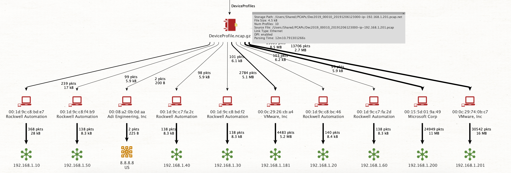

# Device Profiles

## Motivation

Which device on the network uses which IP address? Which addresses / devices did it contact?

How are devices related to each other, how does communication flow?

Identifying devices within a network is a good starting point for any investigation and helps to understand complex situations and relations quickly. The **DeviceProfile** custom decoder implements exactly this, and is enabled from v0.5 on by default.

> Note: DeviceProfile currently get written when processing all traffic is done - that means when using live capture, the profiles will be available when processing stopped. Future versions will implement a flushing mechanism similar to the one for Flows / Connections.

DeviceProfiles rely heavily on local resolvers to be set up and configured. You can use the **DeviceProfile** audit records without resolvers, but you will get less information. Read more about the resolvers here:



Analyzing DeviceProfiles can be done using Maltego, for example:





## DeviceProfile Audit Records

Lets look at the protocol buffer definition for a device profile:

```erlang
message DeviceProfile {
    string             MacAddr            = 1;
    string             DeviceManufacturer = 2;
    repeated IPProfile DeviceIPs          = 3;
    repeated IPProfile Contacts           = 4;
    int64              NumPackets         = 5;
    string             Timestamp          = 6; // first seen
    uint64             Bytes              = 7;
}
```

As you can see, a DeviceProfile is a summary structure built around the hardware address of a physical device. It captures the addresses that have been used, as well as the contacted addresses in form of IPProfiles, among other meta information, like the number of packets or the hardware manufacturer.

Lets take a closer look at an IPProfile:

```erlang
message IPProfile {
    string                 Addr            = 1;
    int64                  NumPackets      = 2;
    string                 Geolocation     = 3;
    repeated string        DNSNames        = 4;
    string                 TimestampFirst  = 5;
    string                 TimestampLast   = 6;
    repeated string        Applications    = 7;
    map<string, string>    Ja3             = 8; // ja3 to lookup
    map<string, Protocol>  Protocols       = 9;
    uint64                 Bytes           = 10;
    map<string, Port>      DstPorts        = 11; // Ports to bytes
    map<string, Port>      SrcPorts        = 12; // Ports to bytes
    map<string, int64>     SNIs            = 13;
}
```

This is the information associated with a single ip address. Note how in addition to general meta data like the number of packets, bytes and timestamps, there is also information retrieved from the new resolvers API, namely the geolocation and dns names.

Additionally, the results from Deep Packet Inspection for all flows seen from or towards this IP are added as well, in addition to the Server Name Indicators seen and flow statistics for each seen port number from this address.

To enhance encrypted telemetry, Ja3 fingerprints seen for this host are mapped to lookup results from the Ja3 database.

