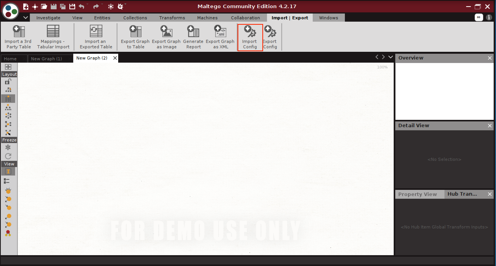
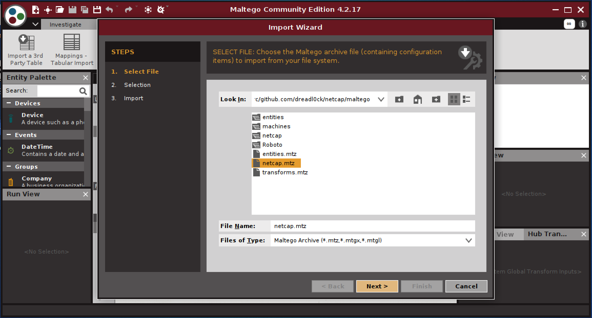
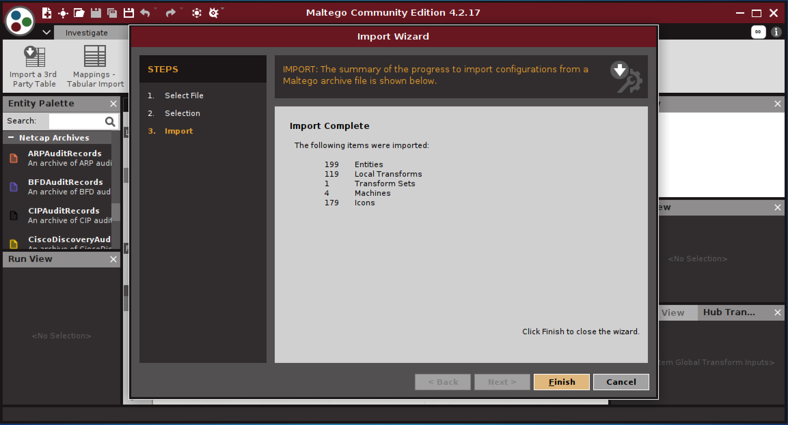
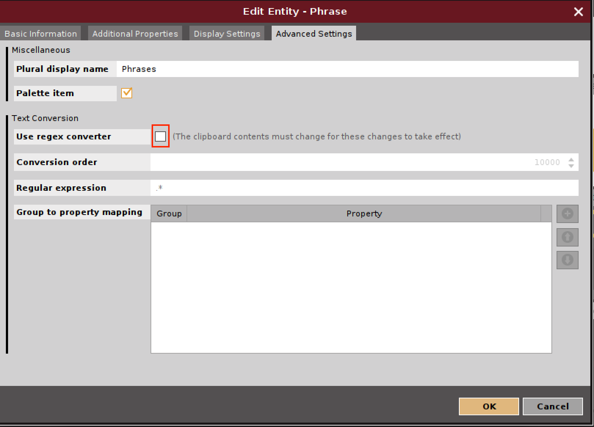
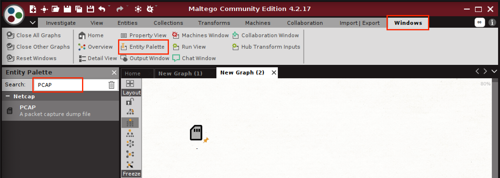
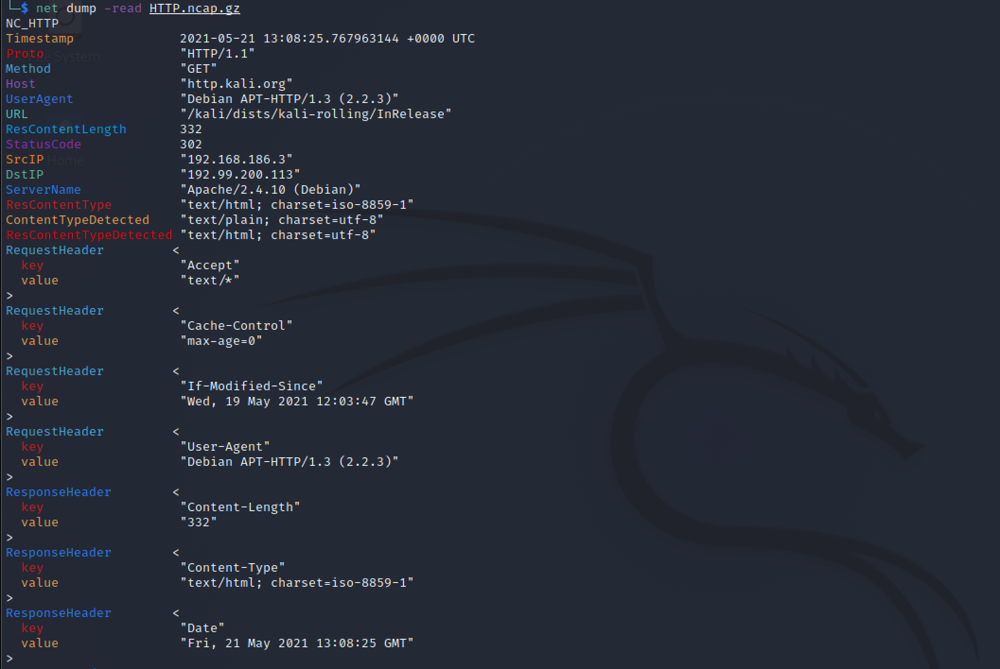

# Kali Linux

## Prepare Kali Image

Covers basic setup of Kali Linux, you can skip this if you have a configured installation in front of you.

Grab a fresh Kali image from: [https://www.kali.org/downloads/](https://www.kali.org/downloads/)

After logging in with the default user **kali** and password **kali**, open a terminal prompt.

Set language for your keyboard \(add to ~/.zshrc to persist\), I've chosen the German layout here:

```text
$ setxkbmap de
```

Update to latest version of Kali:

```text
$ apt update
$ apt upgrade -y
```

In case you are using a VMWare machine, ensure to update **open-vm-tools-desktop** and **fuse**, so that the shared clipboard and mounting volumes works:

```text
$ sudo apt update
$ sudo apt install -y --reinstall open-vm-tools-desktop fuse
$ sudo reboot -f
```

Configure any volumes you want to mount and use the script provided by the kali authors to mount it:

```text
$ cat <<EOF | sudo tee /usr/local/sbin/mount-shared-folders
#!/bin/sh
vmware-hgfsclient | while read folder; do
  vmwpath="/mnt/hgfs/\${folder}"
  echo "[i] Mounting \${folder}   (\${vmwpath})"
  sudo mkdir -p "\${vmwpath}"
  sudo umount -f "\${vmwpath}" 2>/dev/null
  sudo vmhgfs-fuse -o allow_other -o auto_unmount ".host:/\${folder}" "\${vmwpath}"
done
sleep 2s
EOF
$ sudo chmod +x /usr/local/sbin/mount-shared-folders
$ sudo mount-shared-folders
[i] Mounting PCAPs   (/mnt/hgfs/PCAPs)
```

## Install NETCAP

You have two options: install a binary release, or compile from source.

### Install binary release

Download the latest release: [https://github.com/dreadl0ck/netcap/releases](https://github.com/dreadl0ck/netcap/releases) 

### Compile from source

#### Install Go

I recommend to install Go via snap on debian systems, the aptitude packages are often outdated.

```text
# install snap package manager
$ sudo apt install snapd
$ sudo systemctl start snapd
$ sudo systemctl enable snapd

# install go
$ sudo snap install go --classic

# ensure apparmor service is running and will be restarted automatically
# to prevent errors when running binaries installed via snap after reboot
$ sudo systemctl start apparmor
$ sudo systemctl enable apparmor
```

add the following directories as a **prefix** to your PATH in the **~/.zshrc** file as well as to **/root/.zshrc**:

```text
export PATH="/home/kali/go/bin:/snap/bin:/usr/local/bin:$PATH"
```

To have the correct PATH when using sudo, update the **secure\_path** override using:

```text
$ sudo visudo
...
Defaults    secure_path="/home/kali/go/bin:/snap/bin:/usr/local/bin:<original-path>"
```

Source it and verify the go compiler binary is found by the shell:

```text
$ source ~/.zshrc
$ go version
go version go1.16.3 linux/amd64
```

#### Install Dependencies

We need the libpcap development headers:

```text
$ sudo apt install libpcap-dev
```

now its time to fetch the NETCAP source code and use the build scripts to compile.

```text
$ mkdir -p /home/kali/go/src/github.com/dreadl0ck
$ cd /home/kali/go/src/github.com/dreadl0ck
$ git clone https://github.com/dreadl0ck/netcap
```

You have two options again: Build with bindings for DPI or compile without.

Compiling with the DPI bindings will dynamilly load libndpi and libprotoident at runtime, and therefore these have to be installed on the system.

If you do not need the DPI functioniality for now, you can simply compile netcap without.

#### Compile with DPI

```text
$ cd /home/kali/go/src/github.com/dreadl0ck/netcap
$ sudo zeus/scripts/install-debian.sh
```

This will fetch and compile libprotoident and DPI, and then compile NETCAP. The DPI libs are pretty big and compilation will take 10-20mins depending on your hardware. Time to get a coffee.

#### Compile without DPI

```text
$ sudo zeus/generated/install-linux-nodpi.sh
```

Either way, you should now have the **net** binary in your PATH, verify by running:

```text
$ net
                       / |
 _______    ______   _10 |_     _______   ______    ______
/     / \  /    / \ / 01/  |   /     / | /    / \  /    / \
0010100 /|/011010 /|101010/   /0101010/  001010  |/100110  |
01 |  00 |00    00 |  10 | __ 00 |       /    10 |00 |  01 |
10 |  01 |01001010/   00 |/  |01 \_____ /0101000 |00 |__10/|
10 |  00 |00/    / |  10  00/ 00/    / |00    00 |00/   00/
00/   10/  0101000/    0010/   0010010/  0010100/ 1010100/
                                                  00 |
Network Protocol Analysis Framework               00 |
created by Philipp Mieden, 2018                   00/
v0.5.13

available subcommands:
  > capture       capture audit records
  > util          general util toool
  > proxy         http proxy
  > label         apply labels to audit records
  > export        exports audit records
  > dump          utility to read audit record files
  > collect       collector for audit records from agents
  > transform     maltego plugin
  > help          display this help

usage: ./net <subcommand> [flags]
or: ./net <subcommand> [-h] to get help for the subcommand

$ sudo net
[same output]
```

### Databases

To fetch the netcap databases for data enrichment, first install the git large file storage extension:

```text
$ sudo apt install git-lfs
```

Create the filesystem path and ensure the permissions are correct for the kali user:

```text
$ sudo mkdir -p /usr/local/etc/netcap
$ sudo chown -R kali /usr/local/etc/netcap
```

Now you can use the following command to clone the latest version of the database repository from [https://github.com/dreadl0ck/netcap-dbs](https://github.com/dreadl0ck/netcap-dbs) to the correct place on the filesystem. The tool will ask for confirmation before starting the download and displays the expected file size:

```text
$ net util -clone-dbs
This will fetch 3.3 GB of data. Proceed? [Y/n]: 
Cloning into '/usr/local/etc/netcap'...
remote: Enumerating objects: 1031, done.
remote: Counting objects: 100% (252/252), done.
remote: Compressing objects: 100% (152/152), done.
remote: Total 1031 (delta 77), reused 252 (delta 77), pack-reused 779
Receiving objects: 100% (1031/1031), 510.95 MiB | 9.35 MiB/s, done.
Resolving deltas: 100% (325/325), done.
cloned netcap-dbs repository to /usr/local/etc/netcap
done! Downloaded databases to /usr/local/etc/netcap/
```

Now that you have the databases, you are good to go.

Remember you can update them using the following command, from any location on the filesystem:

```text
$ net util -update-dbs
Already up to date.
```

The databases are rebuilt from their sources daily at midnight.

You can read more about the resolvers that make use of the DBs here: 



### Maltego

Start Maltego, register an account for the community edition and authenticate.

Next, load the netcap configuration for Maltego, by switching to the **Import \| Export** Tab and hit **Import Config**



If you installed from source, navigate to the following path and load the **maltego.mtz** configuration archive: **/home/kali/go/src/github.com/dreadl0ck/netcap/maltego**

Otherwise, just download the latest version from github.com: [https://github.com/dreadl0ck/netcap/raw/master/maltego/netcap.mtz](https://github.com/dreadl0ck/netcap/raw/master/maltego/netcap.mtz)






### Configuring the file type matcher preference

In order for Maltego to sucessfully detect the type of files you copy and paste into it, we need to disable using the generic **maltego.Phrase** matcher, because it will always match first. Select **Manage Entities**, search for the Phrase entity, edit it by clicking on the three little dots and deselect the shown checkbox in the **Advanced Settings**:




Make sure the changes are saved by hitting **OK**. Now you should be able to copy and paste files into Maltego as described below.

#### Importing PCAP or audit record files via Copy and Paste

Drag and Drop of entities does not seem possible for Maltego on Kali yet \(it works on macOS\), so the most convenient way to load a PCAP file into Maltego is by selecting the file in the file explorer, hit Ctrl-C or CMD-C \(VMWare on macOS\) to copy the path to the clipboard, and then paste that path directly into a Maltego graph.

The NETCAP configuration registered regular expressions to handle files that end on pcap or pcapng, so these should be detected as a **netcap.PCAP** entity automatically. The same should work as well for .ncap and .ncap.gz audit record files.

If sucessful, the imported entity should look like this:


#### Importing PCAP files into Maltego manually

Alternatively to importing files by copy and paste, you can add new entity of type netcap.PCAP to the graph manually, then double click it and set the mandatory field containing the path of the PCAP file on disk.



Double click the file, switch to the Properties Tab and set a name and file path:


Either way, after importing the file executing a right click should show you the following NETCAP transforms:



Running the **To Audit Records \[NETCAP\]** transform will start NETCAP to process the pcap file!

Afterwards, you should see audit records in Maltego:


### Installing IDA

For the '**Open File in Disassembler**' transform to open extracted binary files in the IDA dissassembler to work, we need to install IDA, or move your existing installation to the expected place on the filesystem.

To install, grab a download link from: [https://hex-rays.com/ida-free/\#download](https://hex-rays.com/ida-free/#download)

At the time of this writing it is: [https://out7.hex-rays.com/files/idafree76\_linux.run](https://out7.hex-rays.com/files/idafree76_linux.run)

```text
$ wget https://out7.hex-rays.com/files/idafree76_linux.run
$ chmod +x idafree76_linux.run
$ ./idafree76_linux.run
[click Next in graphical installer]
```

Next, add **/usr/local/bin/ida** to your PATH in **~/.zshrc**:

```text
export PATH="/usr/local/bin/ida:$PATH"
```

Move the downloaded files there and source the **~/.zshrc**:

```text
$ sudo mv /usr/local/bin/idafree-7.6 /usr/local/bin/ida  
$ source ~/.zshrc

# confirm that you can open ida
$ ida64
[launches gui]
```

### Utils

Optional, but very useful to inspect data generated by netcap on the commandline are **tree** and **batcat**, you can install them with:

```text
$ sudo snap install batcat
$ sudo apt install tree
```

For example, you can inspect extracted TCP streams with ANSI colors using batcat. Everything that is colored in red has been transferred by the client, everything in blue is from the server, just like in wireshark.

Enter a directory with netcap audit records where the capture tool was executed the **-conns** flag \(enabled by default\) and run:

```text
$ batcat tcp/world-wide-web-http/*
```


> Tip: use batcat -A to view binary connection data in the terminal

Lets examine the tree command output to understand what files and directories are produced by NETCAP. Move into a directory that was created as output by the capture tool \(**-out** flag, defaults to current directory\) and run:

```text
$ tree -h .
```


You can see there are two different file types on the top level:

* .log

Log files from different components of NETCAP, for diagnostic purposes. The main log file **netcap.log** always contains the log output that was written to the console when the NETCAP engine was executed.

* .ncap.gz

NETCAP audit records compressed with gzip. In order to read them, you need to use the **net dump** sub command, e.g:


The following directories can be generated, depending on the configuration:

* files \(or custom name, provided via **-fileStorage** flag, default name is files\)

The output directory of the files extracted from network connections, structured according to the detected content MIME type.

* tcp \(generated when **-conns** flag is set, enabled by default\)

Extracted **TCP** connection data, structured based on the service names obtained by looking up the used port numbers in the IANA database. Colorized with ANSI escape sequences, red is client, blue is server.

* udp \(generated when **-conns** flag is set, enabled by default\)

Extracted **UDP** connection data, structured based on the service names obtained by looking up the used port numbers in the IANA database. Colorized with ANSI escape sequences, red is client, blue is server.

Also **codium** is a nice IDE and text editor to inspect source code:

```text
$ sudo snap install codium
```


