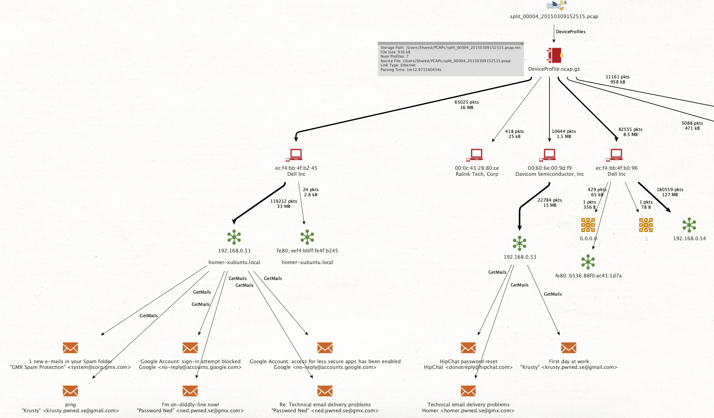
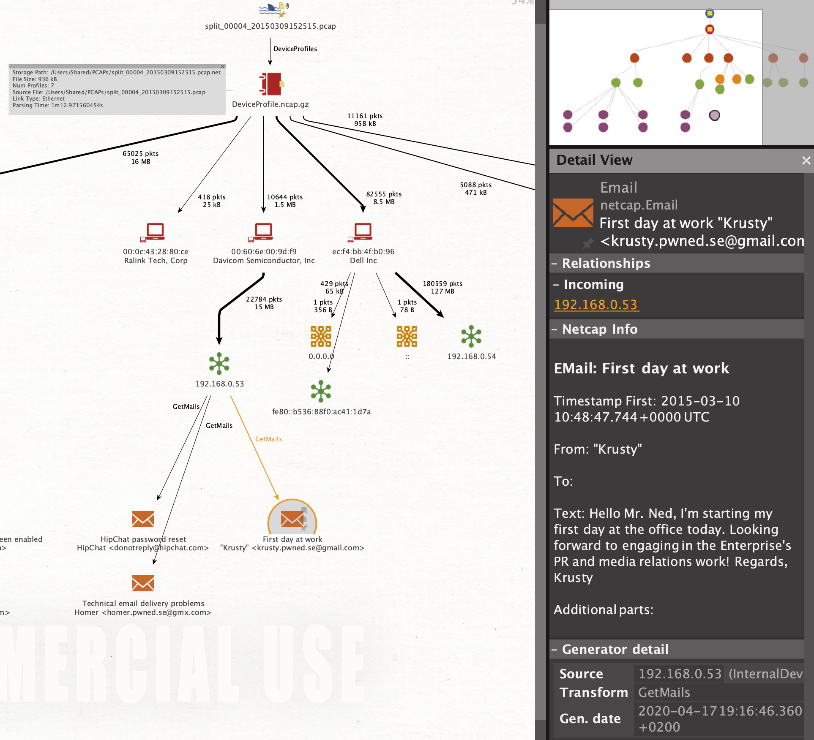

# Email Extraction

## Motivation

Emails are a key communication mechanism that holds plenty of digital evidence, starting from Mail header information about the sender and route, to transferred files via attachments.

Netcap currently extracts Email fetched over POP3 and support IMAP is in the making.

## POP3

A POP3 audit record contains information about the addresses involved, as well as authentication information. The fetched mails are provided as an array of **Mail** instances.

```erlang
message POP3 {
    string           Timestamp              = 1;
    string           ClientIP               = 2;
    string           ServerIP               = 3;
    string           AuthToken              = 4;
    string           User                   = 5;
    string           Pass                   = 6;
    repeated Mail    Mails                  = 7;
}
```

A Mail instance has the following fields:

```erlang
message Mail {
    string            ReturnPath            = 1;
    string            DeliveryDate          = 2;
    string            From                  = 3;
    string            To                    = 4;
    string            CC                    = 5;
    string            Subject               = 6;
    string            Date                  = 7;
    string            MessageID             = 8;
    string            References            = 9;
    string            InReplyTo             = 10;
    string            ContentLanguage       = 11;
    bool              HasAttachments        = 12;
    string            XOriginatingIP        = 13;
    string            ContentType           = 14;
    string            EnvelopeTo            = 15;
    repeated MailPart Body                  = 16;
}
```

For exploring captured emails, the Maltego Integration can be used:







## SMTP

For SMTP an audit record is also available, though mail extraction has not been implemented yet:

```erlang
message SMTP {
    string                 Timestamp     = 1;
    bool                   IsEncrypted   = 2;
    bool                   IsResponse    = 3;
    repeated SMTPResponse  ResponseLines = 4;
    SMTPCommand            Command       = 5;
    PacketContext          Context       = 6;
}
```

