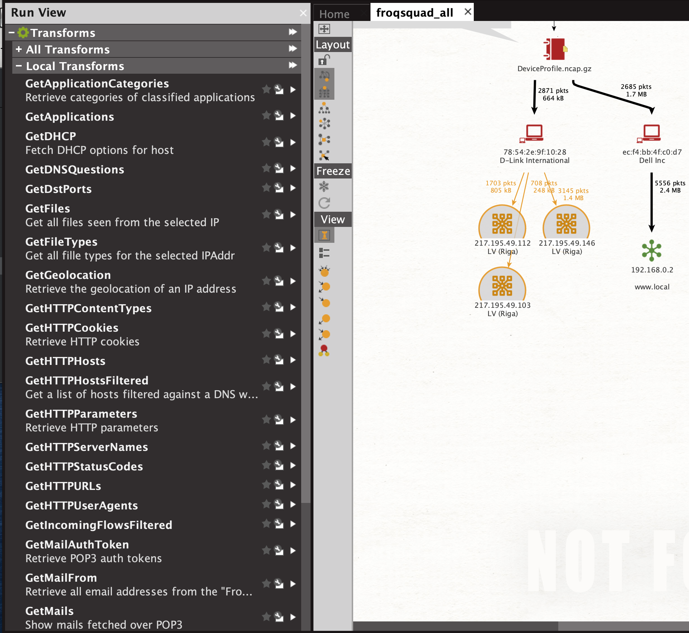
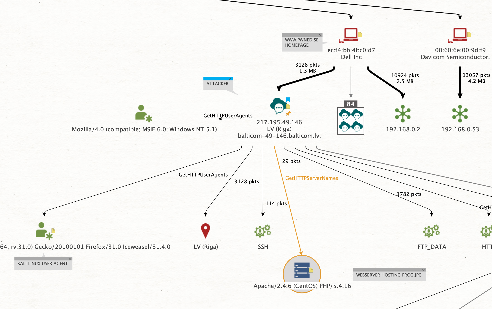
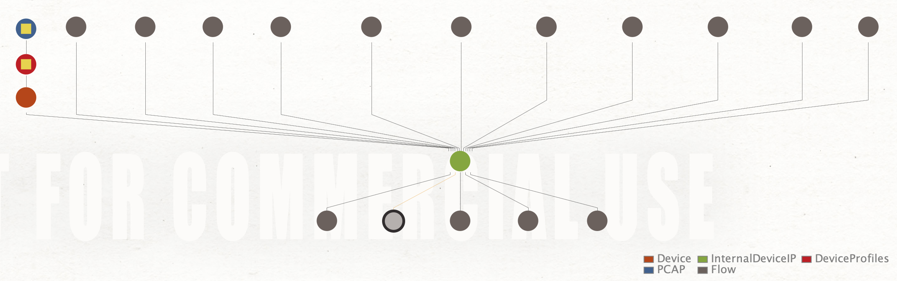

# Maltego Integration

## Introduction

**Maltego** is an open source intelligence \(OSINT\) and graphical link analysis tool for gathering and connecting information for investigative tasks.



It allows to transform data using external knowledge and visualize the results in a graph topology.

Transforms are small pieces of code that automatically fetch data from different sources and return the results as visual entities in the desktop client. Transforms are the central elements of Maltego which enable its users to unleash the full potential of the software whilst using a point-and-click logic to run analyses.

Netcap provides a set of entities and transformations to work with packet capture dump files in maltego.

The current implementation focuses on behavorial analysis of entities within the traffic dump.

## Installation

Ensure netcap **&gt;= v0.5** is installed and can be found in **$PATH**:

```text
$ net -version
v0.5
```

Ensure the **net** binary is placed in **/usr/local/bin**:

```text
$ which net
/usr/local/bin/net
```


Transformations in maltego have to specify a working directory. Currently /**usr/local** is used for this so make sure the current user has sufficient right to enter the directory. No data will be written there, all logs from transformations that invoke the netcap core are written into dedicated directories for each processed pcap file.


Next, download install the maltego transformations and enities for netcap:

Currently there are **20 entities** and **42 transformations** implemented. You can download them here:



Import them into Maltego in the "**Import / Export Config**" tab under "**Import Config**".

## Loading PCAP files into Maltego

To load a pcap file into maltego you have two options:

1\) Drag and Drop the file into a maltego graph. The files type will be **maltego.File** by default, and the path to the file on disk is set as a note on the entity.

Now, change the entities type to **netcap.PCAP**, and double click it to open the detail view. Copy the filesystem path from the **Notes** tab into the **path** property of the PCAP entity.

2\) Create a new **netcap.PCAP** entity and set the **path** property to the path of your pcap file on disk

## Running Transformations

Right click an entity and start typing **Get** into the search bar to see all available transformations for the selected type. Alternatively you can also use the **Run View** in the **Windows** tab to see and launch available transformations with a single click.



## Configuration

Netcap offers an **OpenFile** maltego transform, which will pass filetypes except for executables to the default system application for the corresponding file format. On macOS the open utility will be used for this and on the linux the default is gio open. You can override the application used for this by setting **NC\_MALTEGO\_OPEN\_FILE**.

## Gallery







